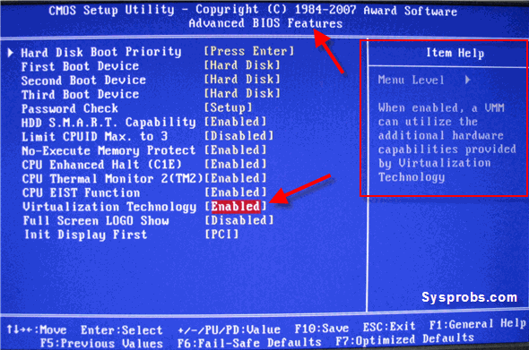
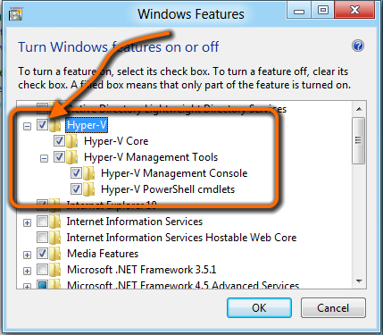

Installing Docker Desktop
=========================

We're going to install Docker Desktop, and turn on Kubernetes mode.  If you can't get Docker Desktop running, see steps below to use Minikube or MicroK8s instead.


Install Docker Desktop for your OS
----------------------------------

### Linux

Follow the instructions on https://docs.docker.com/ for your OS:

- Ubuntu: https://docs.docker.com/install/linux/docker-ce/ubuntu/
- Debian: https://docs.docker.com/install/linux/docker-ce/debian/
- CentOS: https://docs.docker.com/install/linux/docker-ce/centos/
- Fedora: https://docs.docker.com/install/linux/docker-ce/fedora/
- Other: https://docs.docker.com/install/linux/docker-ce/binaries/

Follow the instructions on https://kubernetes.io/docs/tasks/tools/install-kubectl/#install-kubectl-on-linux to install `kubectl`.


### Mac

1. Visit [https://docs.docker.com/docker-for-mac/install/#what-to-know-before-you-install](https://docs.docker.com/docker-for-mac/install/#what-to-know-before-you-install) to ensure you have the requirements necessary.

2. Download [Docker Desktop](https://hub.docker.com/editions/community/docker-ce-desktop-mac) (either Edge or Stable) and install as you would any Mac app. It'll invite you to create a free account to download.

   


### Windows

1. Turn on virtualization in the bios.  Every bios is different, so you'll need to search for the specifics.



2. Install Windows Subsystem for Linux version 2.  See also https://docs.microsoft.com/en-us/windows/wsl/install-win10

   Run these commands in an admin terminal:

   ```
   dism.exe /online /enable-feature /featurename:Microsoft-Windows-Subsystem-Linux /all /norestart
   dism.exe /online /enable-feature /featurename:VirtualMachinePlatform /all /norestart
   ```

   Install https://wslstorestorage.blob.core.windows.net/wslblob/wsl_update_x64.msi

   Run these commands in an admin terminal:

   ```
   wsl --set-default-version 2
   ```

   Optional: download a Linux distribution of choice from the Microsoft store.  See https://docs.microsoft.com/en-us/windows/wsl/install-win10#step-6---install-your-linux-distribution-of-choice  Most tutorials assume you've chosen Ubuntu.  The "Ubuntu" package will always include the latest Ubuntu version, currently 20.04.  Once you install your distro of choice, you must run it from the start menu, and choose your admin password before it will show in `wsl --list`.

3. Is your WSL distribution version 2?

   Check your version:

   ```
   wsl --list --verbose
   ```

   If it's not version 2:

   ```
   wsl --set-version Ubuntu 2
   ```

   Replace Ubuntu with your Linux package name.

4. Download [Docker Desktop for Windows](https://hub.docker.com/editions/community/docker-ce-desktop-windows) (either Edge or Stable) and install as you would any Windows app.  It'll invite you to create a free account to download.

5. Carefully pick "Linux Containers mode" when prompted.

6. Gratuitous reboots.


### Docker in a VM

If you're installing Docker in a VMware Workstation VM, see [this post](https://communities.vmware.com/thread/498837) to get a VMware Workstation virtual machine to run Docker.  This assumes you've enabled virtualization on the host's bios so you can run VMware.

If you're installing Docker in a Windows VM running inside Parallels on your mac, see [this post](http://tattoocoder.com/configure-docker-for-windows-under-parallels/) to configure Parallels for nested virtualization.

If you're not in a VM, you can skip this section.


Verify it Works
---------------

1. Ensure you're in Linux containers:

   In the system tray (by the clock), right-click on the whale icon, and ensure it says "Switch to Windows Containers".  If you find an option that says "Switch to Linux Containers", select this option.

2. Ensure Docker works:

   From a command prompt / terminal, type:

   ```
   docker --version
   ```

   then type

   ```
   docker run hello-world
   ```

   If both of these work as expected, you've succeeded!


Enable Kubernetes Mode
-----------------

1. In the Task tray (bottom-right on Windows, top-right on Mac), click on the whale icon, and choose settings.

2. Switch to the Kubernetes tab, enable Kubernetes, and click apply.  The first time you do this it'll take a good while to download all the containers and start the Kubernetes control plane.

   

### **Don't have the Kubernetes tab?**

- If you don't have the Kubernetes tab in your Docker settings, upgrade your version of Docker.

- If running Docker Desktop on Windows, ensure you're in Linux Containers mode. Right-click on the whale icon, "Switch to Linux Containers".  If it says "Switch to Windows Containers" you're in the right place.


Verify kubectl works
--------------------

`kubectl` is the command-line for Kubernetes, and was installed by Docker when you enabled Kubernetes mode.

From a command prompt / terminal, type:

```
kubectl version
```

If this returns a result for both client and server, you've succeeded!

```
kubectl config get-contexts
```

Ensure the selected context is "docker-desktop".  If it isn't, run this:

```
kubectl config use-context docker-desktop
```


Start downloading docker images
-------------------------------

Downloading docker images takes a while, so let's kick this off so we make sure they exist when we need them:

**Note**: Running on Windows?  Ensure you're in Linux mode.  Right-click on the docker system tray icon, and choose "Switch to Linux Containers".  If it says "Switch to Windows containers" you don't need to do anything, you're already there.

1. `docker pull node:alpine`
2. `docker pull mcr.microsoft.com/dotnet/core/sdk:3.1-alpine`
3. `docker pull mcr.microsoft.com/dotnet/core/aspnet:3.1-alpine`

If you get an error about throttled docker pull requests, change the commands to this:

1. ```
   docker pull robrich.azurecr.io/node:alpine
   docker tag robrich.azurecr.io/node:alpine node:alpine
   ```
2. ```
   docker pull robrich.azurecr.io/dotnet-core-sdk:3.1-alpine
   docker tag robrich.azurecr.io/dotnet-core-sdk:3.1-alpine mcr.microsoft.com/dotnet/core/sdk:3.1-alpine
   ```
3. ```
   docker pull robrich.azurecr.io/dotnet-core-aspnet:3.1-alpine
   docker tag robrich.azurecr.io/dotnet-core-aspnet:3.1-alpine mcr.microsoft.com/dotnet/core/aspnet:3.1-alpine
   ```

Alternate Docker Runtimes
-------------------------

If Docker Desktop isn't working for you because of firewall issues or you don't have admin access to your machine or you have Windows 7 or 8, or other issues, you can try these alternate Docker runtimes:

A. [Minikube](https://github.com/kubernetes/minikube/) is a single-node Kubernetes cluster in a Linux VM.  This package works on Mac, Windows, and Linux.

   1. Choose one virtualization platform:

      a. Install VirtualBox from https://www.virtualbox.org/wiki/Downloads

      OR

      b. Install `Hyper-V` from Start -> Control Panel -> Programs and Features -> Turn Windows Features on or off.

         

   2. Download latest version of Minikube for your OS from https://github.com/kubernetes/minikube/releases and rename it to `minikube` or `minikube.exe` (Windows).

   3. Optional: you may choose to create a new folder like `C:\Program Files\Minikube` and move the minikube executable into it, then add Minikube to your path.  See also https://helpdeskgeek.com/windows-10/add-windows-path-environment-variable/

   4. Optional: You may wish to give Minikube more RAM and CPUs:

      ```
      minikube config set memory 4096
      minikube config set cpus 4
      ```

      These numbers are good defaults, but you may need to adjust these numbers to be less than the CPUs and RAM you have available on your machine.

   5. Start Minikube:

      a. If using VirtualBox:

         ```
         minikube start
         ```

      OR

      b. If using Hyper-V:

         ```
         minikube start --vm-driver="hyperv" --hyperv-virtual-switch="YOUR_EXTERNAL_SWITCH_HERE" --kubernetes-version=stable
         ```

         Change the namve of the switch to match your switch.  Start -> Hyper-V -> Virtual Switch Manager -> find the switch marked as "External"

   6. Set docker environment variables:

      ```
      minikube docker-env
      ```

      Copy and paste these environment variables into your terminal.

   7. Download `kubectl` for your OS from https://kubernetes.io/docs/tasks/tools/install-kubectl/

   8. Optional: you may choose to move kubectl to the same folder as minikube and put it in your path.

   9. Change URLs in examples.

      Unlike Docker Desktop, Minikube does not automatically proxy localhost into the Docker VM.  Instead, you'll need to specify the name or IP of the Minikube VM.

      In all the examples that say `http://localhost:...` you'll need to swap them to say `http://minikube:...`

   10. Windows only: Minikube on Hyper-V doesn't automatically mount volumes.  Note that Hyper-V isn't listed in https://minikube.sigs.k8s.io/docs/handbook/mount/#driver-mounts

       When we get to the Volumes section in examples 04 and 05, you'll first need to mount the folder into the Minikube VM:

       ```
       minikube mount "C:\Users\YourName\path\to\folder:/mnt/folder --ip ...
       ```

       Get your current IP using `ipconfig`. Choose the IP that matches the switch you used to start Minikube above.

       Then use this Linux path when creating the mount:

       ```
       docker run -v /mnt/folder:/path/inside/container image-name
       ```

B. [MicroK8s](https://microk8s.io/) runs on most Linux distributions, and is a light-weight, single-node Kubernetes cluster with Docker installed.

   When using microk8s, swap the command line `docker` with `microk8s.docker` in all examples.

   You'll also need to download `kubectl` for your OS from https://kubernetes.io/docs/tasks/tools/install-kubectl/

C. [k3s](https://k3s.io/) runs on most Linux distributions but doesn't run on Windows or Mac. It's a light-weight, single-node Kubernetes cluster but it doesn't include Docker build.  For this reason you'll not find much success with k3s in this course.


### Verify

After you have a Docker and Kubernetes runtime installed, verify they both work as expected:

```
docker --version
docker run hello-world
kubectl version
```

If you get no errors from any of these commands, you're good to start pulling images.  Return to the section marked "Start downloading images" and run the `docker pull ...` commands.
