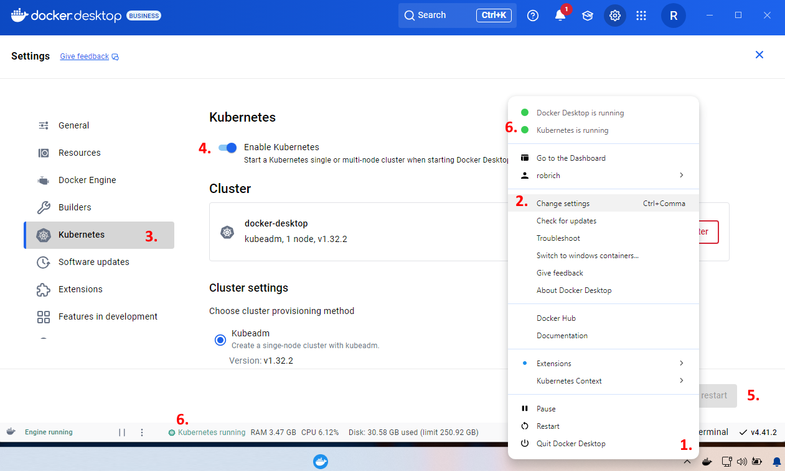

Installation
============

Due to the magic of the Solliance platform, almost everything is already setup for you.  What often takes an hour or two to setup, is already done.

In the Azure portal you'll see:

1. An Azure Kubernetes Service

2. An Azure Container Registry

3. The VM you're using now

Inside the VM, we already have:

1. Docker Desktop

2. VS Code

3. Visual Studio

4. Google Chrome

Connect to the VM
-----------------

1. Switch to the Lab Environment tab in this portal.

2. Copy the Lab DNS Name.

3. Open your RDP program of choice, and paste in the name.

4. Enter the username and password from the Lab Environment, and connect.

The rest of today's experience will be inside this virtual machine.  You can open this lab documentation in the VM as well.

Complete the VM setup
---------------------

To complete the setup, you'll need to do 2 things:

1. Enable Kubernetes mode in Docker Desktop:

   - Right-click on the whale icon and choose settings

   - Click on the gear on the top-right

   - Click on Kubernetes on the left

   - Turn on "Kubernetes Mode"

   - On the bottom-right, click "Apply and Restart"

   

2. Run `WSL Setup.bat`

   This will login to Azure, pull the images we'll use, and setup a few other things.

With these two things out of the way, we're ready to jump in.
