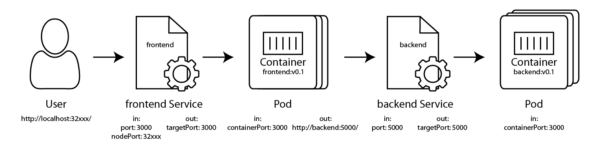

A bigger site
=============

Welcome to the deep end of the pool.  :D  We're going to take the site from exercise 4, and get it running on Kubernetes.

Here's your challenge: build the deployment.yaml and service.yaml for both frontend and backend so they can communicate.

Here's a network diagram of the application we'll build:



1. We connect to http://localhost:32xxx, the nodePort of frontend service.
2. Kubernetes automatically proxies this across the Kubernetes "router" to the LAN side.
3. frontend service load balances across all instances of frontend pod created by frontend deployment.
4. frontend service connects to a chosen frontend pod on port 3000.
5. frontend pod connects to http://backend:5000/
6. Because backend service is named `backend`, the backend service receives this request.
7. backend service load balances across the 1 instance of backend pod created by backend deployment.
8. backend service connects to backend pod on port 5000.
9. backend pod processes the request, and replies.
10. Traffic flows back through all the steps.
11. The browser renders the page.

When working locally, we'll skip the Ingress step because Ingress doesn't work well with Docker Desktop and Minikube.  We'll use Ingress when we get to cloud-hosted Kubernetes.


Step 0: Build the Images
------------------------

For this exercise, we're going to be using the `frontend:0.1` and `backend:0.1` images built in exercise 4.

1. Run `docker image list` and ensure both `frontend:0.1` and `backend:0.1` are present in the list.  If not, return to exercise 4 to build these images.


Frontend
--------

1. Create a frontend folder.

2. Copy the `deployment.yaml` from exercise 7, and the `service.yaml` from exercise 8 into this frontend folder.  We don't need the `pod.yaml` file from exercise 6.

   **Bonus:** Don't copy/paste, but rather retype these files to build muscle memory and familiarity with the file formats.

3. Open up `deployment.yaml`.

4. Modify it to reference the `image: frontend:0.1`.

5. Change other references from `hellonode` to `frontend`.

6. Open up `service.yaml`.

7. Change the name from `name: hellonode-service` to `name: frontend`

   This will become the DNS name for this service to other pods in the cluster.

8. Change references from `hellonode` to `frontend`.


Backend
-------

1. Create a backend folder.

2. Copy the `deployment.yaml` and `service.yaml` from the Frontend steps above into the `backend` folder.

   **Bonus:** Don't copy/paste, but rather retype these files to build muscle memory and familiarity with the file formats.

3. Modify the `backend` folder's `service.yaml` and `deployment.yaml` from port 3000 to port 5000.

4. Modify the `backend` folder's `deployment.yaml` to specify `replicas: 1`.

   **Note:** The code has a static list of all the votes (pretending to be a database), so we only want one of them.  If we were doing this for real, we'd store this data in an external database, and ramp the backend replicas up to at least 3 for high availability.

5. Modify other references in both backend files, renaming everything from `frontend` to `backend`.

6. In `service.yaml`, rename `backend-service` to `backend`.

   The service name is the DNS entry for other pods to consume.  In `frontend`'s source code in `routes/index.js` it specifies `http://backend:5000`.  The frontend is able to resolve this URL to the backend because the backend service is named `backend`.


Schedule all the things
-----------------------

1. Open a terminal in the **backend** folder, and run this command:

   ```
   kubectl apply -f service.yaml
   ```

   Note: we'll be using Kubernetes's DNS service to discover the backend service, so the backend service must exist before we schedule the frontend deployment to create these DNS entries.

2. Schedule the backend deployment:

   ```
   kubectl apply -f deployment.yaml
   ```

3. `cd` into the **frontend** folder, and run these commands:

   ```
   kubectl apply -f deployment.yaml
   kubectl apply -f service.yaml
   ```

4. Check on all the things:

   ```
   kubectl get all
   ```

   Are all the pods, services, and deployments running?


Visit the site
--------------

1. Let's get the `NodePort` that K8s automatically assigned to the frontend service

   ```
   kubectl get svc
   ```

   Note the `NodePort` (the 30,000 range port) for the `frontend`.

2. Browse to `http://localhost:NODE_PORT/` substituting the `NodePort` you found above.  My service was on port `30123` so I'll browse to `http://localhost:30123/`.

Success!  We're using microservices in Kubernetes!
