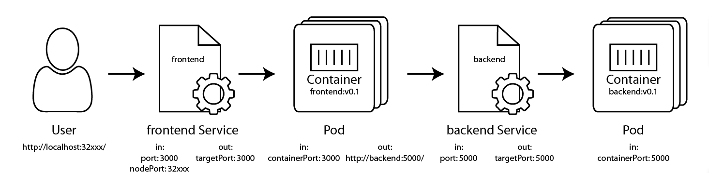

A bigger site
=============

Welcome to the deep end of the pool.  :D  We're going to take the site from exercise 4, and get it running on Kubernetes.

Here's your challenge: build the deployment.yaml and service.yaml for both frontend and backend so they can communicate.

Here's a network diagram of the application we'll build:



1. We connect to http://localhost:32xxx, the nodePort of frontend service.
2. Kubernetes automatically proxies this across the Kubernetes "router" to the LAN side.
3. frontend service load balances across all instances of frontend pod created by frontend deployment.
4. frontend service connects to a chosen frontend pod on port 3000.
5. frontend pod connects to http://backend:5000/
6. Because backend service is named `backend`, the backend service receives this request.
7. backend service load balances across the 1 instance of backend pod created by backend deployment.
8. backend service connects to backend pod on port 5000.
9. backend pod processes the request, and replies.
10. Traffic flows back through all the steps.
11. The browser renders the page.

When working locally, we'll skip the Ingress step because Ingress doesn't work well with Docker Desktop and Minikube.  We'll use Ingress when we get to cloud-hosted Kubernetes.


Step 0: Build the Images
------------------------

For this exercise, we're going to be using the `frontend:0.1` and `backend:0.1` images built in exercise 4.

1. Run `docker image list` and ensure both `frontend:0.1` and `backend:0.1` are present in the list.  If not, return to exercise 4 to build these images.


Frontend
--------

1. Create a frontend folder.

2. Copy the `deployment.yaml` from exercise 7, and the `service.yaml` from exercise 8 into this frontend folder.  We don't need the `pod.yaml` file from exercise 6.

   **Bonus:** Don't copy/paste, but rather retype these files to build muscle memory and familiarity with the file formats.

3. Open up `deployment.yaml`.

4. Modify it to reference the `image: frontend:0.1`.

5. Change other references from `hellonode` to `frontend`.

6. Add a section at the bottom of the container definition setting the environment variable to the backend:

   ```
        ports:
        - containerPort: 3000
        env: # <-- add lines starting here
        - name: BACKEND
          value: http://backend:5000
   ```

   This setting exactly matches the value in the frontend Dockerfile, so technically it's not necessary. But it's nice to document the environment variables this container expects. If we want to change this to `http://dev-backend:5000` or similar, we can easily configure that here.

7. Open up `service.yaml`.

8. Change the service's name from `name: hellonode-service` to `name: frontend`.

   This will become the DNS name for this service to other pods in the cluster.

9. Change references from `hellonode` to `frontend`.

10. Optional: If you want to specify the service's `nodePort` in the yaml file, change this port to be unique in the range 32000-33999.  If using a Kind cluster, ensure it's one of the ports forwarded in `00-Install/kind.yaml`.


Backend
-------

1. Create a backend folder.

2. Copy the `deployment.yaml` and `service.yaml` from the Frontend steps above into the `backend` folder.

   **Bonus:** Don't copy/paste, but rather retype these files to build muscle memory and familiarity with the file formats.

3. Modify the `backend` folder's `service.yaml` and `deployment.yaml` from port 3000 to port 5000.

4. Modify the `backend` folder's `deployment.yaml` to specify `replicas: 1`.

   **Note:** The code has a static list of all the votes (pretending to be a database), so we only want one of them.  If we were doing this for real, we'd store this data in an external database, and ramp the backend replicas up to at least 3 for high availability.

5. Modify other references in both backend files, renaming everything from `frontend` to `backend`.

6. In `service.yaml`, change the service name from `name: backend-service` to `name: backend`.

   The service name is the DNS entry for other pods to consume.  In `frontend`'s source code in `routes/index.js` it specifies `http://backend:5000`.  The frontend is able to resolve this URL to the backend because the backend service is named `backend`.

   If you'd prefer a different naming convention, change both the service name here and the `frontend`'s `routes/index.js` file with your new convention.

7. Optional: If you want to specify the service's `nodePort` in the yaml file, change this port to be unique in the range 32000-33999.  If using a Kind cluster, ensure it's one of the ports forwarded in `00-Install/kind.yaml`.


Schedule all the things
-----------------------

1. Open a terminal in the **backend** folder, and run this command:

   ```
   kubectl apply -f service.yaml
   ```

   Note: we'll be using Kubernetes's DNS service to discover the backend service, so the backend service must exist before we schedule the frontend deployment to create these DNS entries.

2. Schedule the backend deployment:

   ```
   kubectl apply -f deployment.yaml
   ```

3. `cd` into the **frontend** folder, and run these commands:

   ```
   kubectl apply -f deployment.yaml
   kubectl apply -f service.yaml
   ```

4. Check on all the things:

   ```
   kubectl get all
   ```

   Are all the pods, services, and deployments running?


Visit the site
--------------

1. Let's get the `NodePort` that K8s automatically assigned to the frontend service

   ```
   kubectl get svc
   ```

   Note the `NodePort` (the 30,000 range port) for the `frontend`.

2. Browse to `http://localhost:NODE_PORT/` substituting the `NodePort` you found above.  My service was on port `30123` so I'll browse to `http://localhost:30123/`.

Success!  We're using microservices in Kubernetes!


Debugging the site
------------------

### No answer

Did you visit localhost:32001 and get no answer? Maybe the containers aren't running.

```
kubectl get all
kubectl describe pod/YOUR_POD_NAME_HERE
```

Change the pod name to match one of the pods.

Scroll down to the bottom and look at the events. Did we get an image pull failure? Did the container crash?

### ECONNREFUSED

Did you get `ECONNREFUSED`? It sounds like the frontend isn't able to reach the backend. Let's split the problem in half:

```
kubectl exec --stdin --tty pod/frontend-YOUR_POD_NAME_HERE -- sh
```

Change the pod name to match a pod you retrieved from `kubectl get all`.

Much like `docker exec ...` this creates a shell inside the container.

```
ping backend
```

Did it ping successfully? If so, the problem may be the ports or the environment variable. If not, the problem may be a misnamed service or the frontend pod was started before the backend service existed.

### kubectl port-forward

For some reason, it doesn't work.  Is the issue with the frontend service?  With the backend deployment?  What happened?  Let's skip over earlier components and make sure later components are working.

#### Connect to the pod

1. `kubectl get all,ing`, locate the name of the pod you'd like to connect to.  In this example I'll choose a frontend pod.

2. `kubectl port-forward pod/frontend-YOUR_POD_NAME 3000:3000`

    This tells Kubernetes to setup a tunnel from `localhost` to the pod directly, skipping the service and ingress.

3. Browse to http://localhost:3000/

4. Hit cntrl-c to stop the port-forward

Did the pod come up?  If so, the problem is with the service or the ingress.  If not, the problem is with the pod or the deployment.

#### Connect to the service

1. `kubectl port-forward service/frontend 3000:3000`

   This tells Kubernetes to setup the tunnel from `localhost` to the service, and the service will round-robin across the pods.

2. Browse to http://localhost:3000/

3. Hit cntrl-c to stop the port forward

Did the service come up?  If so, the problem is with the service.  Is it of type ClusterIP?  If not, the problem is with the link between the service and the deployment.  Did we typo a name?
